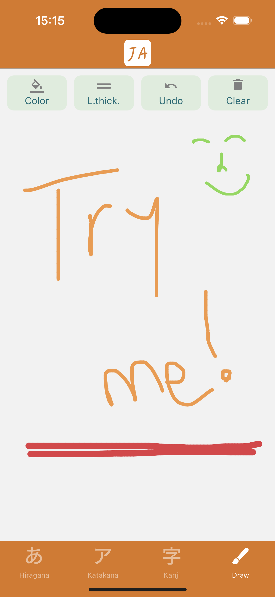
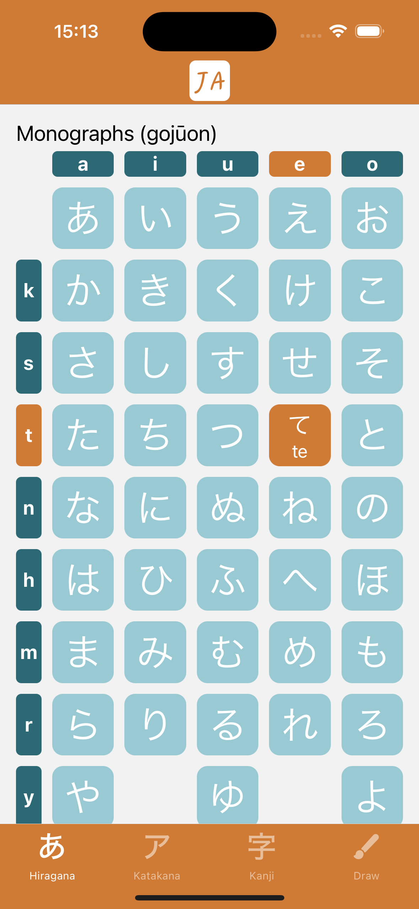
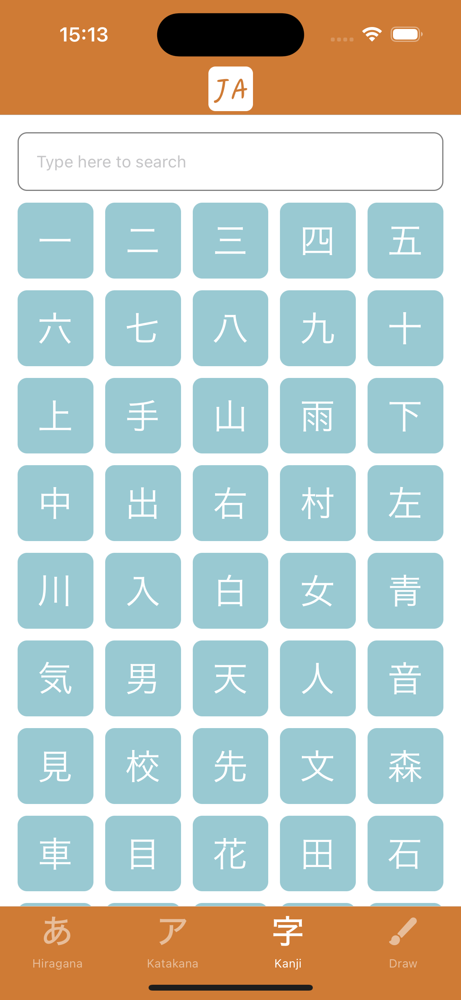
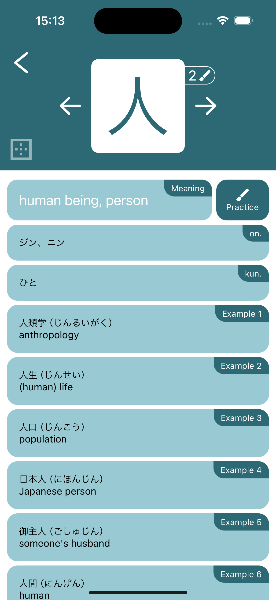
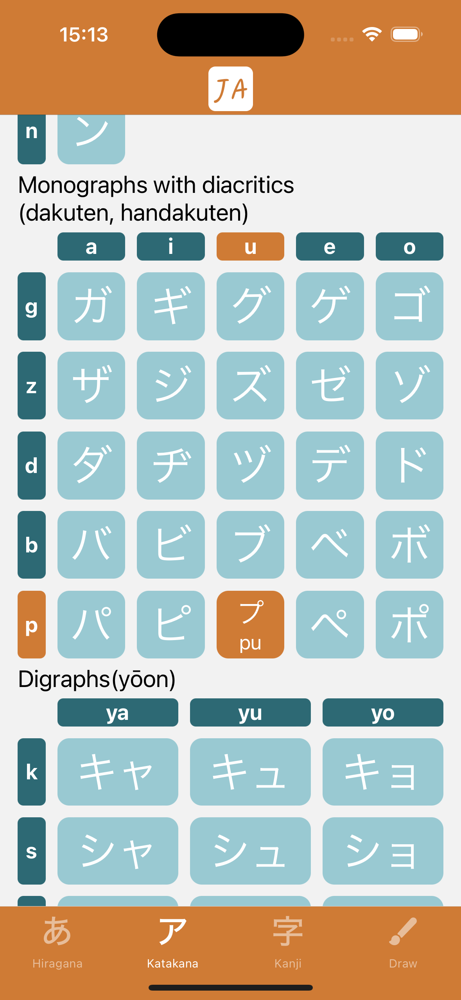

# 🇯🇵 Japanese Learning App (React Native)

A mobile app for learning Japanese writing systems: **Hiragana**, **Katakana**, and **Kanji**.  
Includes interactive charts, pronunciation info, and a custom practice canvas.

## 📘 Overview

This app is built for beginners who want to learn Japanese through visual interaction and hands-on practice.

Users can:
- Explore full Hiragana and Katakana character charts
- Tap characters to view pronunciation and English meaning
- Learn Kanji with meaning, examples, and pronunciation types (onyomi/kunyomi)
- Practice writing characters using a drawing canvas
- Navigate smoothly using a bottom tab bar

## ✨ Features

- Full Hiragana and Katakana charts with tap-to-view details
- Detailed Kanji screen: meaning, onyomi, kunyomi, examples
- Practice mode to draw Kanji strokes
- Bottom tab navigation between sections
- Search Kanji by meaning
- Fully offline — uses static data files

## 🈶 What You Learn

The app teaches the three Japanese writing systems:

- **Hiragana (ひらがな)** – used for native Japanese words and grammar
- **Katakana (カタカナ)** – used for foreign words, names, and emphasis
- **Kanji (漢字)** – Chinese-origin characters used for meaning and structure

Each Kanji includes:
- Meaning
- Onyomi (Chinese-style reading)
- Kunyomi (Japanese-style reading)
- Stroke count
- Examples of how it’s used

Plus, users can practice writing Kanji on a built-in drawing canvas.

## 📸 Screenshots

<div align="center">
  
  
  
  
  
</div>


### 📦 Install Dependencies

```bash
yarn install
```

## 🚀 Running the Project

> Before you begin, make sure your environment is set up for React Native:  
👉 [React Native - Environment Setup](https://reactnative.dev/docs/environment-setup)


To get started, follow these steps:
```bash
yarn start
yarn android or yarn ios
```

## 🧰 Tech Stack

- **React Native** `0.74.1`
- **TypeScript** `5.0.4`
- **React Navigation** – screen navigation
- **@terrylinla/react-native-sketch-canvas** – drawing functionality
- **React Native Vector Icons** – for iconography
- **Async Storage** – for persistent local data

## 📌 Future Improvements

- Add stroke-order animations for Kanji
- Add audio pronunciation for characters
- Add a quiz or test mode for self-assessment
- Allow users to favorite and save characters
- Track progress (completed characters, stats)
- Theme customization (dark/light mode)


## 👤 Author

Made by **Andrei** — Junior React Native Developer passionate about clean UI, educational tools, and leveling up fast.


## ✉️ Contact

Feel free to reach out:

- GitHub: (https://github.com/BusuRN)
- LinkedIn: (https://www.linkedin.com/in/andrei-busuioc-b692b02aa/)
- Email: andreialexandrubusuioc@outlook.com
